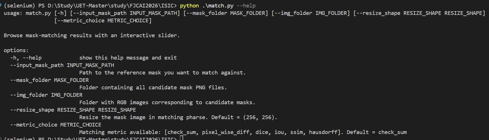
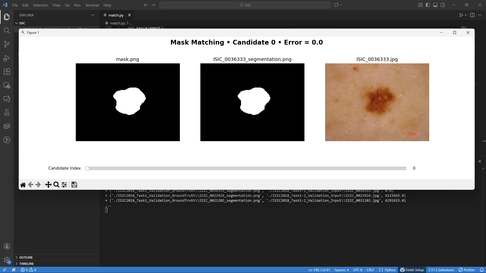
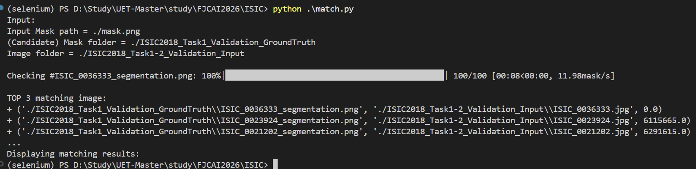

# Mask Matching – ISIC2018

## 1. Introduction

This project provides a compact visualization tool for comparing one reference segmentation mask against an entire gallery of candidate masks from the **ISIC 2018 dataset**.

The script:

- loads your reference mask
- scans a folder full of candidate mask PNG files
- compares each candidate against the reference using a selected **matching metric**
- sorts candidates by similarity
- launches an interactive window where you can **slide** through all matches to inspect:

  - the reference mask
  - the candidate mask
  - the associated RGB image
  - the computed matching error

It serves as a convenient way to answer the question:

> **“Which masks resemble my mask the most?”**

---

## 2. Supported Matching Metrics

The updated script supports six comparison metrics (selectable with `--metric_choice`):

| Metric Name       | Description                                               |
| ----------------- | --------------------------------------------------------- |
| `check_sum`       | Absolute difference between the sums of pixel intensities |
| `pixel_wise_diff` | L1 pixel-wise difference                                  |
| `dice`            | Dice loss = 1 − Dice Coefficient                          |
| `iou`             | IoU loss = 1 − Intersection over Union                    |
| `ssim`            | Structural Similarity Index (1 − SSIM)                    |
| `hausdorff`       | Boundary-aware Hausdorff distance                         |

Choose them via:

```sh
--metric_choice dice
```

---

## 3. Environment Setup

Install using either **conda** or **pip**. All dependencies are listed below.

### **requirements.txt**

```
numpy
pillow
tqdm
matplotlib
scikit-image
scipy
```

### **Using conda**

```sh
conda create -n maskmatch python=3.10 -y
conda activate maskmatch
pip install -r requirements.txt
```

### **Using pip (no conda)**

```sh
python3 -m venv venv
source venv/bin/activate   # Windows: venv\Scripts\activate
pip install -r requirements.txt
```

---

## 4. How to Run

The script accepts several optional arguments:

| Argument            | Meaning                                                             |
| ------------------- | ------------------------------------------------------------------- |
| `--input_mask_path` | Path to the reference mask                                          |
| `--mask_folder`     | Folder containing candidate mask PNGs                               |
| `--img_folder`      | Folder containing corresponding RGB images                          |
| `--resize_shape`    | Resize shape used before computing the metric (default `(256,256)`) |
| `--metric_choice`   | Choice of similarity metric                                         |

Show usage:

```sh
python match.py --help
```

Typical run:

```sh
python match.py \
    --input_mask_path ./mask.png \
    --mask_folder ./ISIC2018_Task1_Validation_GroundTruth \
    --img_folder ./ISIC2018_Task1-2_Validation_Input \
    --metric_choice dice \
    --resize_shape 256 256
```

After processing, the script prints:

- the top 3 best matches
- the full sorted candidate list
- then launches the interactive visualization window

---

## 5. Examples

Below are examples illustrating the workflow.

---

### **(1) Help Display**



This screenshot shows the argument list displayed using:

```sh
python match.py --help
```

You’ll see the list of arguments, each accompanied by a short description explaining what it controls. It provides a quick snapshot of how to steer the script without guessing.

---

### **(2) Matching Plot with Slider**



This is the interactive viewer that appears after mask comparison.
From left to right:

1. Reference mask
2. Selected candidate mask
3. Corresponding RGB image

Above them, the figure title highlights the candidate index and the associated error metric. Below the trio, a slider lets you sweep through all candidates effortlessly — like scrubbing through frames of an anatomical film reel.

---

### **(3) Terminal Output**



This terminal excerpt appears after the scanning and sorting phase. It displays:

- arguments input for the script
- the progress bar used during mask comparison
- the top 3 best-matching candidates (sorted by smallest error)
- a confirmation message before launching the visualization window

It provides a clear, concise summary before the visual deep dive begins.
